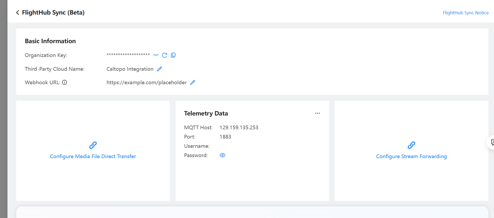
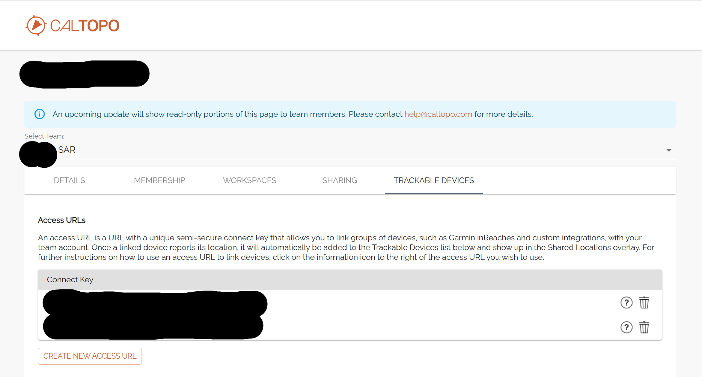

# Drone Telemetry to CalTopo

This project ingests drone telemetry data from [FlightHub 2 - DJI](https://fh.dji.com/) via an MQTT broker, extracts GPS coordinates, and sends location updates to the [CalTopo API](https://caltopo.com/) for live tracking.

No installation is required — a working server is already available. Simply follow the instructions, register your FlightHub account, and provide your CalTopo access token, and the integration will run automatically for seven days. You can register as many times as needed; there is no limit.

🔁 If you want to use multiple CalTopo tokens for the same drone, you'll need to register each one separately.

📝 **Prerequisites**  
- Access permissions in **DJI FlightHub** to configure telemetry data sharing  
- Access permissions in **CalTopo** to manage trackable device tokens  
- The **serial number** of your drone  
- An active **Telegram account** to complete the registration process via our bot

## 🛠️ Step-by-Step Guide

### Step 1:  Configure DJI FlightHub

⚠️ Note: You must have sufficient permissions to set the sync settings.
Open your browser and go to:
👉 https://fh.dji.com/user-center#/my-organization

Actions -> Organization Settings (gear icon) -> FlightHub Sync (Beta)

Click **Edit** next to **Telemetry Data** and enter the following:

MQTT Host: 129.159.135.253  
Port: 1883  
Username: (leave blank)  
Password: (leave blank)

Click Save.

⚠️ Note: Username and password are not supported yet—leave them blank.

### Step 2: Get Access token from Caltopo

⚠️ Note: You must have sufficient permissions in the CalTopo group to view or create access tokens.

Navigate to your CalTopo group’s administration page.

Scroll down to the “Trackable Devices” section.

Click “Create New Access URL” (or use an existing one if already available).

Copy the **Access Token** — this will be used to send location data from the drone to CalTopo.

🔒 Keep this token secure — anyone with it can send location updates to your group.

 

### Step 3:  Register your drone using our telegram bot 

---

This project was developed for the **Megilot Search and Rescue (SAR) Unit**, and is openly available for use by any SAR unit worldwide — or by anyone interested in integrating drone telemetry with mapping and navigation software.

For **feature requests**, **bug reports**, or **technical assistance**, please contact:
👉 dji.caltopo.sync@gmail.com